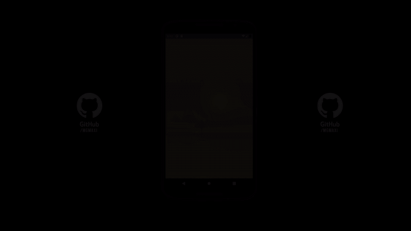

# <b> Weather</b>

This is a project from the specialization program on mobile development of IBM & CaC.

## 📖 <b> About </b>

weather is a project in which you can select a city and get its current weather, min/max temperature and time.
This app fetch data from [Open WeatherMap](https://openweathermap.org/)

## 🛠️ <b> Technologies </b>

- [React Native](https://reactnative.dev)
- [Picker](https://github.com/react-native-picker/picker)
- [Axios](https://axios-http.com)
- [Moment](https://momentjs.com/)
- [API: Open WeatherMap](https://openweathermap.org/)

## 📷 <b> Preview </b>



## 🚀 <b> Setup / Launch</b>

### 🔧 <b>Local Installation</b>

```
git clone https://github.com/mgmaxi/weather
cd ./weather
npm install
```

### ⚙️ <b>Run it</b>

```
Android: "npx react-native run-android"
IOS: "npx react-native run-ios"
```
